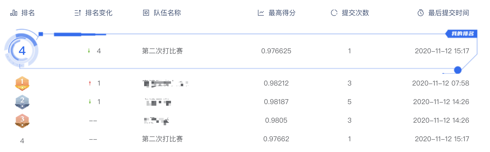

# 中移集成（雄安产业研究院）首届OneCity编程大赛 Baseline 分享

赛道链接: https://www.dcjingsai.com/v2/cmptDetail.html?id=457

## 竞赛背景

本届 OneCity 编程大赛主题围绕智慧城市 OneCity 赋能智慧政务，实现政务数据管理更智慧化、智能化展开。政务数据智能算法包括分类与标签提取，根据政府表格文件标题与内容，按照一定的原则将杂乱无章的文件自动映射到具体的类目上，加速数据归档的智能化与高效化。本次比赛旨在通过抽取政务表格文件中的关键信息，来实现表格数据自动化分类的目标。

## Baseline

这是个文本多分类问题

数据很大，训练集 60000 个文件，测试集 8000 个，但我们只用文件名即可达到 acc 0.9 以上

```
train/市管宗教活动场所.csv              文化休闲
train/价格监测信息公开事项汇总信息_.xls 经济管理
...
```

使用的预训练模型为 chinese-roberta-wwm-ext，训练集验证集 9:1 划分

参数：

```
model_args.max_seq_length = 128
model_args.train_batch_size = 16
model_args.num_train_epochs = 3
```

在 1080Ti 上跑，一个 epoch 需要 12min 左右

线下分数 0.977，线上分数 0.97662 （发文时排在第四）


