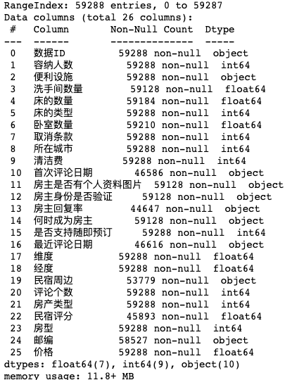
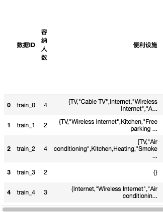

# 结构化比赛: 如何在比赛初期建立一个稳健的 baseline

一般的结构化比赛，都需要在特征工程上耗费 90% 以上的时间。

本文从实战的角度出发，以一个实际的数据比赛例子为例，实验和总结了一些特征工程的常用套路，帮助大家在比赛初期就能建立起一个较为健壮的基线模型。

### 实战数据

本文使用的数据为和鲸社区和 ChallengeHub 共同举办的 DataJoy 新人赛：预测分析·民宿价格预测

链接：https://www.heywhale.com/home/competition/605c426d21e3f6003b56a920/content

数据应该是从 Airbnb 上收集而来，归纳为单表数据。从提交的情况来看，线上线下比较一致。

训练集信息如下：



比赛的目标是预测民宿的价格，是一个回归类型的比赛(优化 RMSE)。

大致情况了解之后，我们就可以着手搭建基线模型了。

### 裸数据基线

首先是完全不做特征工程，做一些简单的数据预处理后，直接塞入 LGBM 多折模型(固定折数和参数)，看下效果。

这里的数据预处理，只做了部分数据的清洗、缺失值的填充(不填充也可以)，和 Object 类型特征的 LabelEncoding：

```
df_features['洗手间数量'].fillna(-1, inplace=True)
df_features['床的数量'].fillna(-1, inplace=True)
df_features['卧室数量'].fillna(-1, inplace=True)
df_features['房主是否有个人资料图片'].fillna('na', inplace=True)
df_features['房主身份是否验证'].fillna('na', inplace=True)
df_features['房主回复率'].fillna('-1', inplace=True)
df_features['房主回复率'] = df_features['房主回复率'].astype(str).apply(lambda x: x.replace('%', ''))
df_features['房主回复率'] = df_features['房主回复率'].astype(int)
df_features['民宿周边'].fillna('na', inplace=True)
mean_score = df_features['民宿评分'].mean()
df_features['民宿评分'].fillna(mean_score, inplace=True)
df_features['邮编'].fillna('na', inplace=True)

for feat in ['房主是否有个人资料图片', '房主身份是否验证', '民宿周边', '邮编']:
    lbl = LabelEncoder()
    lbl.fit(df_features[feat])
    df_features[feat] = lbl.transform(df_features[feat])
```

线下 RMSE 得分：5.5084

### Frequency Encoding

接下来我们考虑类别特征的 encoding 处理。

频率编码，或者也可以称为 Counter 编码，通过计算特征变量中每个值的出现次数来表示该特征的信息，是比赛中最常用的 encoding 方式。

有些特征是数值型特征，但如果 value_counts 比较少，其实也是可以当成类别特征来做频率编码。

```
def freq_enc(df, col):
    vc = df[col].value_counts(dropna=True, normalize=True).to_dict()
    df[f'{col}_freq'] = df[col].map(vc)
    return df

for feat in ['容纳人数', '洗手间数量', '床的数量', '床的类型',
             '卧室数量', '取消条款', '所在城市', '清洁费', 
             '房主是否有个人资料图片', '房主回复率', '是否支持随即预订',
             '民宿周边', '房产类型', '房型', '邮编']:
    df_features = freq_enc(df_features, feat)
```

增加了频率编码特征后，线下 RMSE 得分：5.5114

可以看到分数变差了，但变化不算太大，我们先留着。

### Target Encoding

目标编码的原理这里不多说了(其实我也说不太明白)，通常为了避免过拟合，采用 K-Fold Target Encoding 的方式将类别特征进行编码生成特征。

```
# Target Encoding

def stat(df, df_merge, group_by, agg):
    group = df.groupby(group_by).agg(agg)

    columns = []
    for on, methods in agg.items():
        for method in methods:
            columns.append('{}_{}_{}'.format('_'.join(group_by), on, method))
    group.columns = columns
    group.reset_index(inplace=True)
    df_merge = df_merge.merge(group, on=group_by, how='left')

    del (group)
    gc.collect()
    return df_merge
    

def statis_feat(df_know, df_unknow):
    df_unknow = stat(df_know, df_unknow, ['民宿评分'], {'价格': ['mean', 'std', 'max']})
    df_unknow = stat(df_know, df_unknow, ['邮编'], {'价格': ['mean', 'std', 'max']})

    return df_unknow
    
    
# 5折交叉
df_train = df_features[~df_features['价格'].isnull()]
df_train = df_train.reset_index(drop=True)
df_test = df_features[df_features['价格'].isnull()]

df_stas_feat = None
kf = KFold(n_splits=5, random_state=2021, shuffle=True)
for train_index, val_index in kf.split(df_train):
    df_fold_train = df_train.iloc[train_index]
    df_fold_val = df_train.iloc[val_index]

    df_fold_val = statis_feat(df_fold_train, df_fold_val)
    df_stas_feat = pd.concat([df_stas_feat, df_fold_val], axis=0)

    del(df_fold_train)
    del(df_fold_val)
    gc.collect()

df_test = statis_feat(df_train, df_test)
df_features = pd.concat([df_stas_feat, df_test], axis=0)

del(df_stas_feat)
del(df_train)
del(df_test)
gc.collect()
```

简单地增加了两组 target encoding 后，线下 RMSE 得分：5.5472

分数变差了，而且变差的幅度较大，所以我们暂时先去掉 target encoding。

### 统计特征

对于数值型的特征，我们对其进行 groupby 类别特征下的统计特征。

这里非常方便地可以制造出成千上万个特征，也就是传说中的「一把梭」，但是同时也会造成特征筛选的困难。

```
def brute_force(df, features, groups):
    for method in tqdm(['max', 'min', 'mean', 'median', 'std']):
        for feature in features:
            for group in groups:
                df[f'{group}_{feature}_{method}'] = df.groupby(group)[feature].transform(method)
                
    return df

dense_feats = ['容纳人数', '洗手间数量', '床的数量', '卧室数量', 
               '房主回复率', '评论个数', '民宿评分']
cate_feats  = ['取消条款', '床的类型', '房产类型', '房型', '邮编']

df_features = brute_force(df_features, dense_feats, cate_feats)
```

经过简单的特征筛选后(通过 importance 逐次排序 gain = 0 的特征)，线下 RMSE 得分：5.5264，效果也不是很好，先不采用。

### 交叉特征

交叉特征主要是两两(或者更多)特征之间组合出来的衍生特征，通常会需要一些专业领域的知识(当然也可以一把梭)。

```
df_features['人均床数量'] = df_features['容纳人数'] / (df_features['床的数量'] + 1e-3)  # 1e-3 是为了避免 zero-divide
df_features['人均卧室量'] = df_features['容纳人数'] / (df_features['卧室数量'] + 1e-3)
df_features['卧室床均量'] = df_features['床的数量'] / (df_features['卧室数量'] + 1e-3)
df_features['经纬度平方根'] = (df_features['维度']*df_features['维度'] + df_features['经度']*df_features['经度'])**.5
```

增加了这四个交叉特征后，线下 RMSE 得分：5.5054。

类别特征两两组合可以产生更为细化的类别特征，数值特征两两组合(加减乘除)可以产生更多的数值特征；而这些衍生特征又可以上面的 encoding 和统计等方法产生更多的特征。

### 时间特征

一般是求时间差等交叉衍生特征。

```
# 时间特征处理

df_features['首次评论日期'] = pd.to_datetime(df_features['首次评论日期']).values.astype(np.int64) // 10 ** 9
df_features['何时成为房主'] = pd.to_datetime(df_features['何时成为房主']).values.astype(np.int64) // 10 ** 9
df_features['最近评论日期'] = pd.to_datetime(df_features['最近评论日期']).values.astype(np.int64) // 10 ** 9

df_features['timestamp_diff1'] = df_features['首次评论日期'] - df_features['何时成为房主']
df_features['timestamp_diff2'] = df_features['最近评论日期'] - df_features['首次评论日期']
df_features['timestamp_diff3'] = df_features['最近评论日期'] - df_features['何时成为房主']
```

增加了这三个时间衍生特征后，线下 RMSE 得分：5.4703。

对这些时间衍生特征再做统计特征：

```
dense_feats = ['timestamp_diff1', 'timestamp_diff2', 'timestamp_diff3']
cate_feats  = ['房型']

df_features = brute_force(df_features, dense_feats, cate_feats)
```

线下 RMSE 进一步优化到 5.4680。

### 文本编码

我们可以注意到，在结构化的数据中，其实也有非结构化的字段，如这份数据中的「便利设施」字段，就是个典型的例子：



具体的样本如：

```
'{TV,"Cable TV",Internet,"Wireless Internet","Air conditioning",Kitchen,"Pets live on this property",Dog(s),"Hot tub",Heating,Washer,Dryer,"Smoke detector","Fire extinguisher",Essentials,"translation missing: en.hosting_amenity_49","translation missing: en.hosting_amenity_50"}'
```

我们可以先清洗下文本，让它形成 word / sentence 的形式，方便我们做 TF-IDF 编码：

```
df_features['便利设施'] = df_features['便利设施'].apply(
    lambda x: x.replace('{', '').replace('}', '').replace('"', '').replace(':', '').replace(',', ' '))
# df_features['便利设施'] = df_features['便利设施'].str.lower()

n_components = 12

X = list(df_features['便利设施'].values)
tfv = TfidfVectorizer(ngram_range=(1,1), max_features=10000)
tfv.fit(X)
X_tfidf = tfv.transform(X)
svd = TruncatedSVD(n_components= n_components)
svd.fit(X_tfidf)
X_svd = svd.transform(X_tfidf)

for i in range(n_components):
    df_features[f'便利设施_tfidf_{i}'] = X_svd[:, i]
```

增加了这 12 个 TF-IDF 编码特征后，线下 RMSE 得分：5.4343。

除此之外，我们还可以做 w2v 特征，不过因为我们做 w2v 特征是基于 word 的，因此需要对 w2v 再做如 mean/max 等统计特征，得到一整个 sentence 的特征，代码如下：

```
emb_size = 4
sentences = df_features['便利设施'].values.tolist()

words = []
for i in range(len(sentences)):
    sentences[i] = sentences[i].split()
    words += sentences[i]
    
words = list(set(words))

model = Word2Vec(sentences, size=emb_size, window=3,
                 min_count=1, sg=0, hs=1, seed=2021)

emb_matrix_mean = []
emb_matrix_max = []

for seq in sentences:
    vec = []
    for w in seq:
        if w in model:
            vec.append(model[w])
    if len(vec) > 0:
        emb_matrix_mean.append(np.mean(vec, axis=0))
        emb_matrix_max.append(np.max(vec, axis=0))
    else:
        emb_matrix_mean.append([0] * emb_size)
        emb_matrix_max.append([0] * emb_size)

df_emb_mean = pd.DataFrame(emb_matrix_mean)
df_emb_mean.columns = ['便利设施_w2v_mean_{}'.format(
    i) for i in range(emb_size)]

df_emb_max = pd.DataFrame(emb_matrix_max)
df_emb_max.columns = ['便利设施_w2v_max_{}'.format(
    i) for i in range(emb_size)]

for i in range(emb_size):
    df_features[f'便利设施_w2v_mean_{i}'] = df_emb_mean[f'便利设施_w2v_mean_{i}']
    df_features[f'便利设施_w2v_max_{i}'] = df_emb_max[f'便利设施_w2v_max_{i}']

df_features.head()
```

再加上这 8 个 w2v 编码特征后，线下 RMSE 分数有所下降：5.4436，因此暂不采用。

### 总结

至此，我们得到了一个线下 5.4343 的较为健壮的 baseline，提交到线上为 5.3394，截止到当前，该分数还能排在前十。

这是笔者在做结构化数据比赛时的基本套路，先用裸特征建立初步的基线；然后逐步添加类别特征的频率编码、目标编码；尝试数值特征的统计编码，接着在专业领域内思考下如何构造交叉特征；如果有时间特征，则做时间差等衍生特征；而对于结构化数据内的非结构文本数据，可以考虑 TF-IDF / w2v 等编码方式构造特征。

希望本文对大家在比赛初期能有所帮助。


PS: 这个 notebook 版本是线下 5.4313，线上 5.3304

