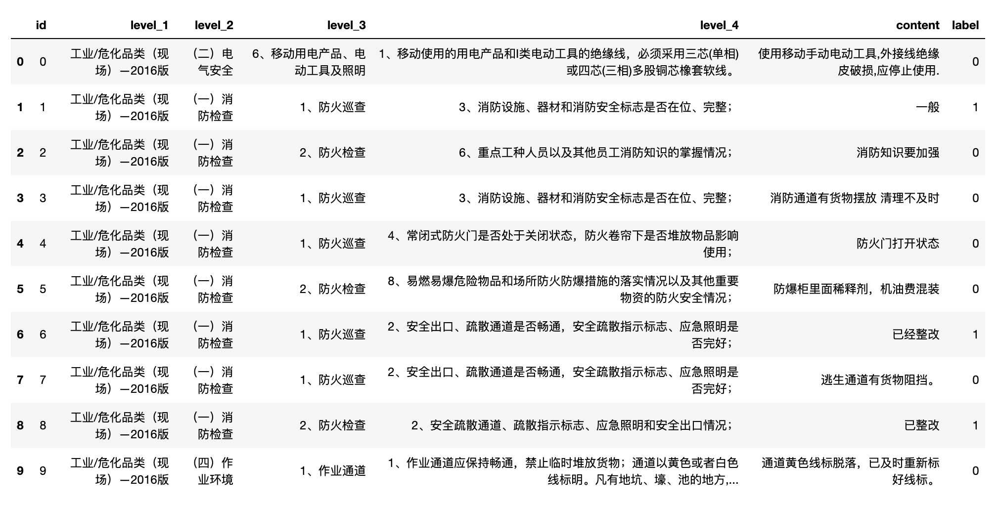

# sodic: 基于文本挖掘的企业隐患排查质量分析模型 baseline 分享

## 赛道链接

https://www.sodic.com.cn/competitions/900010

## 赛题背景

企业自主填报安全生产隐患，对于将风险消除在事故萌芽阶段具有重要意义。企业在填报隐患时，往往存在不认真填报的情况，“虚报、假报”隐患内容，增大了企业监管的难度。采用大数据手段分析隐患内容，找出不切实履行主体责任的企业，向监管部门进行推送，实现精准执法，能够提高监管手段的有效性，增强企业安全责任意识。

## 赛题任务

本赛题提供企业填报隐患数据，参赛选手需通过智能化手段识别其中是否存在“虚报、假报”的情况。

## 数据说明



- 其中“id”为主键，无业务意义；
- “一级标准、二级标准、三级标准、四级标准”为《深圳市安全隐患自查和巡查基本指引（2016年修订版）》规定的排查指引，一级标准对应不同隐患类型，二至四级标准是对一级标准的细化，企业自主上报隐患时，根据不同类型隐患的四级标准开展隐患自查工作；
- “隐患内容”为企业上报的具体隐患；
- “标签”标识的是该条隐患的合格性，“1”表示隐患填报不合格，“0”表示隐患填报合格。

## 建模思路

典型的文本二分类问题。

大概做了一个小时，提交了两次，以下说法有可能不太准确，仅供参考。代码请查阅 github 仓库上的 notebook。

### 常规特征

从上面的 head(10) 就很明显地看出，正样本基本上都是文本比较短的，可以用文本字符串长度来确认。

```
train['content_strlen'] = train['content'].astype(str).apply(len)
train[train['content_strlen']<=3]['label'].mean()
```

可以看到高达 87.7% 的正样本比例。

### 思路1：TF-IDF

使用 jieba 分词后对词语进行 TF-IDF + SVD 降维

```
df['content'].fillna('', inplace=True)
df['content_seg'] = df['content'].apply(lambda x: " ".join(jieba.cut(x)))

n_components = 16

X = list(df['content_seg'].values)
tfv = TfidfVectorizer(ngram_range=(1,1), 
                      token_pattern=r"(?u)\b[^ ]+\b",
                      max_features=10000)
tfv.fit(X)
X_tfidf = tfv.transform(X)
svd = TruncatedSVD(n_components=n_components)
svd.fit(X_tfidf)
X_svd = svd.transform(X_tfidf)

for i in range(n_components):
    df[f'content_tfidf_{i}'] = X_svd[:, i]
```

TF-IDF + strlen 五折后训练 LGBM f1 线下分数：0.8347，线上：0.9009

### 思路2：BERT

直接上 BERT，使用 roberta-wwm-ext 五折训练生成 oof 以及 test 的 prob，

```
oof = []
prediction = test[['id']]
prediction['bert_pred'] = 0

kfold = StratifiedKFold(n_splits=5, shuffle=True, random_state=2021)
for fold_id, (trn_idx, val_idx) in enumerate(kfold.split(train, train['label'])):
    train_df = train.iloc[trn_idx][['content', 'label']]
    valid_df = train.iloc[val_idx][['content', 'label']]
    train_df.columns = ['text', 'labels']
    valid_df.columns = ['text', 'labels']
    
    model_args = get_model_args()
    model = ClassificationModel('bert',
                                'hfl/chinese-roberta-wwm-ext',
                                args=model_args)
    model.train_model(train_df, eval_df=valid_df)
    _, vaild_outputs, _ = model.eval_model(valid_df)
    
    df_oof = train.iloc[val_idx][['id', 'label']].copy()
    df_oof['bert_pred'] = vaild_outputs[:,1]
    oof.append(df_oof)
    
    _, test_outputs = model.predict([text for text in test['content']])
    prediction['bert_pred'] += test_outputs[:, 1] / kfold.n_splits
    
    del model, train_df, valid_df, vaild_outputs, test_outputs
    gc.collect()
```

然后塞进上面的 LGBM 中，再进行五折训练。

线下分数：0.8955，线上分数：0.9506

PS：先执行 simpletransformers.ipynb 生成 prob 再执行 baseline.ipynb。

### TODO:

1. BERT 只训练了一轮，可以训练多几轮看下效果；
2. 使用其他预训练模型；
3. 可能直接使用 BERT 交效果也很好，我没比对过；
4. 不知道其他 level 之类的文本放进来有没有什么用，可以尝试下；
5. 其他的我不知道的骚操作。

